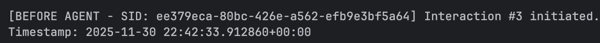
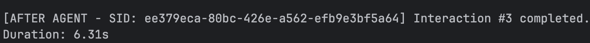
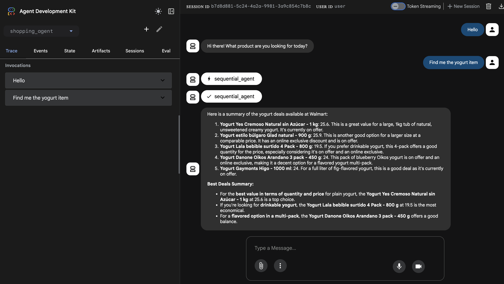

# Shopping Agents

A small and simple shopping assistant agent that can orchestrate sequential agents to search an e-commerce site (Walmart Guatemala), extract page-1 product results and then compare deals to return a top-5 summary.

---

## Proyect Overview -  

- `search_agent`: queries Walmart's product search page for the requested item and returns only the products found on page 1 as a JSON list (fields: productName, imageUrl, brand, selectedPrice, hasOferta, exclusivo, link).
- `deal_comparison_agent`: receives the page-1 product JSON list and uses an LLM to analyze and pick the best deals; it returns a final summary listing the top 5 products (the LLM chooses the comparison criteria).
- `sequential_agent`: runs the `search_agent` then the `deal_comparison_agent` in order, passing outputs between them.
- `root_agent`: orchestrates the process, greets the user, and exposes the sequential agent as an `AgentTool` so the pipeline can be executed from one place.
- There is basic logging that captures before and after callback the following information:
  - Before callback: Capture the session_id, Number of interaction and the timestamp. 
  
  - After callback: Capture the session_id, Number of interaction, the timestamp and the duration of the interaction.
  


- Screenshot of interaction with the agent:



## Problem Statement
Finding the best possible deals when shopping online can be overwhelming due to the vast number of products. An idea to use
AI agents to help users find quickly the best deals on products could be a game-changer for both the user and the e-commerce platform.
With this idea I create a simple shopping assistant that leverages agents to search for one product in one supermarket Guatemala (Walmart in this case),
extract the products for only the first page of results (normally 21 items)and present a summary.

---

## Solution Overview
With the rise of AI agents, we can build simple LLM chatbots with tools that can help the user find best deals of products
without the need of browsing multiple pages and comparing manually. In the future we can request the user needs, preferences 
and budget to make the experience more personalized with memory capabilities.

---

## Architecture — how the agents interact

- `search_agent` — a simple tool that executes `search_item_walmart(product_name)`. It fetches Walmart's search JSON, extracts the first page of product records, formats each product into a normalized JSON object and returns the list.

- `deal_comparison_agent` — receives the product list and relies on a model (Gemini/LiteLlm in the code) to analyze the products. The exact ranking criteria are left to the LLM so it can use the following: price, brand, features, and inferred discounts to pick the best deals.

- `sequential_agent` — a `SequentialAgent` that runs `search_agent` then `deal_comparison_agent`, ensuring outputs are passed correctly.

- `root_agent` — the top-level agent that greets the user, asks what to search for, and uses an `AgentTool` wrapping the sequential agent to get the final summary.

Data flow: user -> root_agent -> sequential_agent (search_agent -> deal_comparison_agent) -> final_summary

---

## Demo (example interaction)

1) Root agent greets the user and asks which product to search for.

2) User: "Pan"

3) `search_agent` runs `search_item_walmart('Pan')` and returns JSON for page 1. Example (fabricated) output:

```json
{
  "products": [
    {
      "productName": "Pan de Molde Integral 500g",
      "imageUrl": "https://i.walmart.com/xxx.jpg",
      "brand": "PanMarca",
      "selectedPrice": 2.35,
      "hasOferta": "No hay oferta",
      "exclusivo": "No hay oferta Exclusiva en línea",
      "link": "https://www.walmart.com.gt/1234"
    },
    {
      "productName": "Pan artesanal 400g",
      "imageUrl": null,
      "brand": "PanArt",
      "selectedPrice": 1.95,
      "hasOferta": "Oferta",
      "exclusivo": "No hay oferta Exclusiva en línea",
      "link": "https://www.walmart.com.gt/2345"
    }
    // ...more items from page 1...
  ]
}
```

4) `deal_comparison_agent` analyzes the list and returns a short final summary (example):


Note: At the begining you can check a screenshoot of how the interaction looks like in the "Demo.png" image in the `imgs` folder.


---

## The Build — how to run locally

Dependencies used in the code (used imports):
- requests
- python-dotenv (dotenv)
- google.genai (types)
- google.adk (agents, models, tools)
- Use adk web to run the agent in a local web server. Run:
```bash
adk web 
```
- To check to logs. Run:
```bash
adk web --log_level DEBUG
```
## What's next (ideas to improve)

- Make logging configurable more useful
- Provide the agent the capacity to ask clarifying questions to the user brand, size, or preferences to refine the search.
- Extend to multiple e-commerce sites for broader comparison and provide a table let the user check side-by-side comparisons.
- Add a memory component to remember user preferences for future searches.
---
